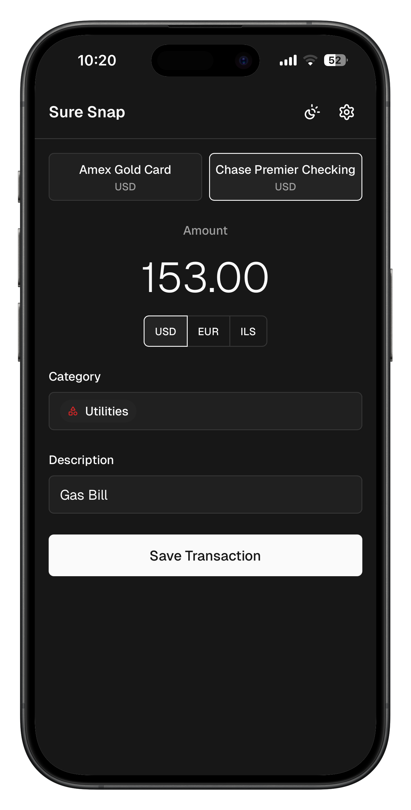
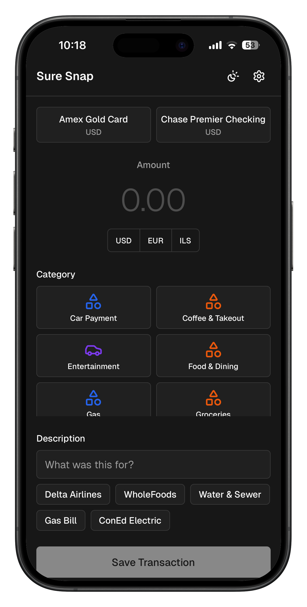
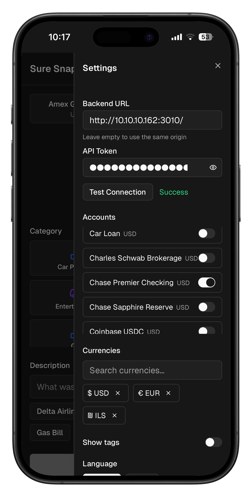
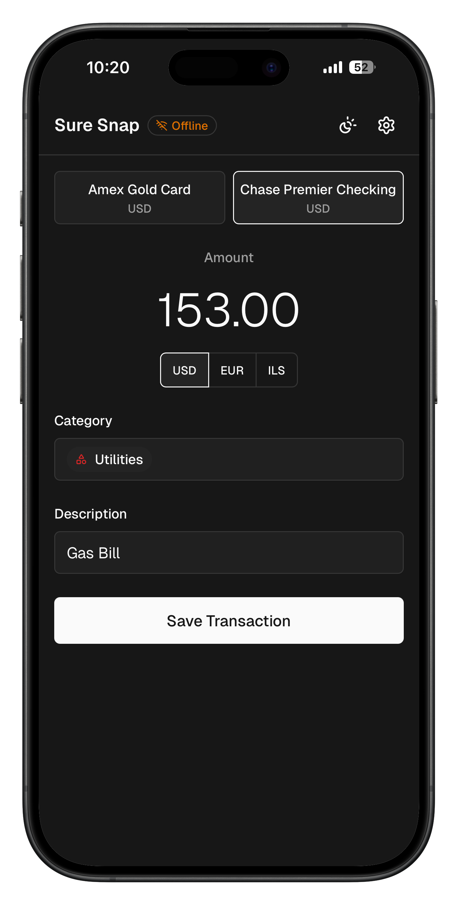
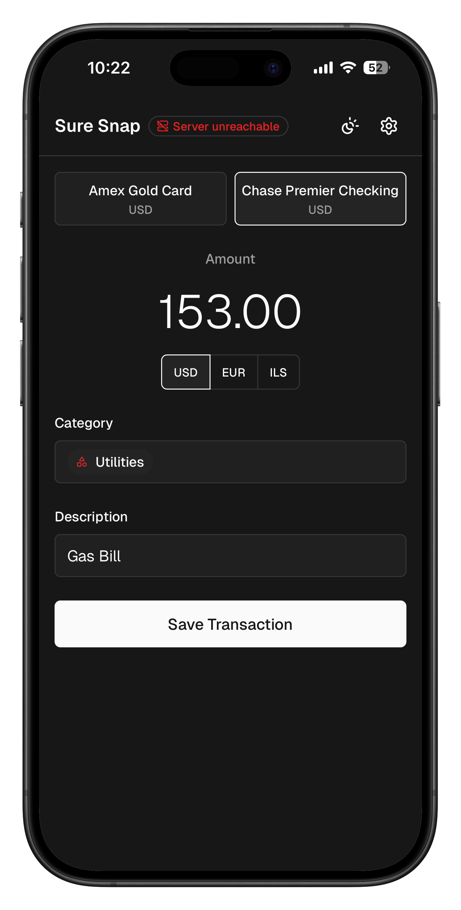

# SureSnap

A fast, offline-first PWA for capturing transactions on the go. Companion app for [Sure](https://github.com/we-promise/sure).

<p align="center">
  
</p>

## Features

- **Quick capture** — log amount, merchant, and category in minimal taps
- **Offline-first** — works without internet; syncs when back online
- **Bilingual** — English and Arabic with full RTL support
- **Installable** — add to home screen on any device via PWA

## Installation

### Docker (recommended)

```bash
docker run -d -p 9052:9052 -p 9053:9053 ghcr.io/abdallatif/sure-snap:latest
```

To proxy API requests to your Sure instance:

```bash
docker run -d -p 9052:9052 -p 9053:9053 \
  -e SURE_API_UPSTREAM=http://your-sure-host:3000 \
  ghcr.io/abdallatif/sure-snap:latest
```

Open `http://localhost:9052` in your browser.

#### HTTPS (required for PWA / service worker)

Service workers require a secure context. Mount TLS certificates to enable HTTPS on port 9053:

```bash
docker run -d -p 9053:9053 \
  -v /path/to/tls.crt:/etc/nginx/certs/tls.crt:ro \
  -v /path/to/tls.key:/etc/nginx/certs/tls.key:ro \
  ghcr.io/abdallatif/sure-snap:latest
```

Open `https://your-host:9053`. Without certs, the container serves HTTP-only on port 9052 (PWA features will only work on `localhost`).

### Docker Compose

Create a `docker-compose.yml`:

```yaml
services:
  sure-snap:
    image: ghcr.io/abdallatif/sure-snap:latest
    ports:
      - 9052:9052
      - 9053:9053
    environment:
      - SURE_API_UPSTREAM=http://sure:3000 # optional
    volumes:
      - ./certs/tls.crt:/etc/nginx/certs/tls.crt:ro  # optional
      - ./certs/tls.key:/etc/nginx/certs/tls.key:ro  # optional
```

```bash
docker compose up -d
```

### Build from source

Requires Node.js 18+ and Yarn 4.

```bash
git clone https://github.com/abdallatif/sure-snap.git
cd sure-snap
corepack enable
yarn install
yarn build
```

The built files are in `dist/`. Serve them with any static file server — for example:

```bash
yarn preview   # serves at http://localhost:4173
```

## Configuration

SureSnap connects to a Sure API backend. Configure the connection in the app's settings screen (API URL and auth token).

When running via Docker, set `SURE_API_UPSTREAM` to enable the built-in reverse proxy so the browser talks to the same origin:

| Variable / Volume | Description | Example |
|----------|-------------|---------|
| `SURE_API_UPSTREAM` | Sure API base URL (optional) | `http://sure:3000` |
| `/etc/nginx/certs/tls.crt` | TLS certificate (optional, enables HTTPS on :9053) | bind-mount |
| `/etc/nginx/certs/tls.key` | TLS private key (optional) | bind-mount |

## Screenshots

<p align="center">
  &nbsp;&nbsp;
  &nbsp;&nbsp;
  &nbsp;&nbsp;
  
</p>
<p align="center">
  <em>Transaction form · Settings · Offline mode · Server unreachable</em>
</p>

## Contributing

See [CONTRIBUTING.md](CONTRIBUTING.md) for development setup and guidelines.

## License

[MIT](LICENSE)
